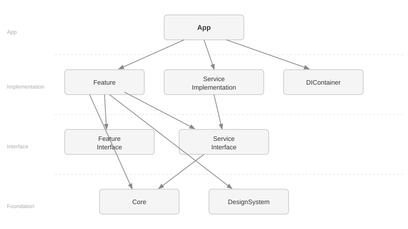
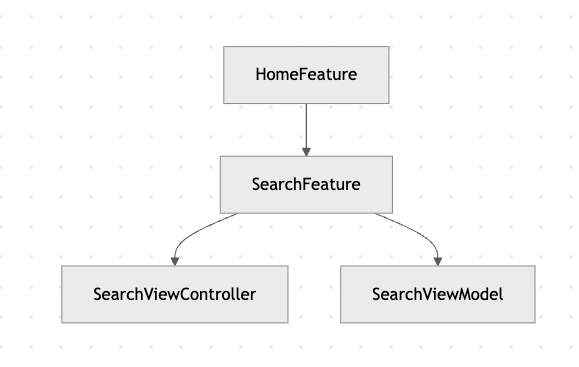

# 프로젝트 구조 및 아키텍처

Flyleaf는 Micro-Features Architecture + Coordinator + MVVM 구조를 기반으로 설계되었습니다.

---

## 목차

1. [아키텍처 개요](#1-아키텍처-개요)
2. [프로젝트 구조](#2-프로젝트-구조)
3. [Micro-Features Architecture](#3-micro-features-architecture)
4. [의존성 설계](#4-의존성-설계)
5. [Interface 모듈](#5-interface-모듈)
6. [Service 모듈](#6-service-모듈)
7. [Builder 패턴](#7-builder-패턴)
8. [Coordinator](#8-coordinator)
9. [MVVM](#9-mvvm)
10. [DIContainer](#10-dicontainer)
11. [전체 흐름](#11-전체-흐름)
12. [설계 장점](#12-설계-장점)

---

## 1. 아키텍처 개요

Flyleaf는 다음 세 가지 설계 원칙을 기반으로 구성되었습니다.

- **기능 단위 모듈화 (Micro-Features)**
- **화면 흐름 분리 (Coordinator)**
- **화면 로직 분리 (MVVM)**

각 계층은 명확한 역할을 가지며, 의존성 방향을 엄격하게 관리합니다.

---

## 2. 프로젝트 구조
```
Root
├── Projects/
│   ├── App/              메인 앱 타겟 (앱 진입점)
│   ├── Core/             공통 비즈니스 로직 및 유틸리티 (도메인 모델, 서비스 등)
│   ├── DIContainer/      의존성 주입 컨테이너 (App 레이어 전용)
│   └── DesignSystem/     UI 컴포넌트 및 스타일 (에셋, 폰트, 컬러 등)
├── Services/
│   ├── AirportSearch/ 
│   │   ├── Implementation/      AirportSearch 기능 구현 (실제 서비스 구현체)
│   │   ├── Interface/           외부에서 사용하는 인터페이스
│   │   ├── Tests/               Implementation 테스트 코드
│   │   └── Testing/             테스트 유틸 또는 Mock
│   └── ...      
├── Features/
│   ├── Home/
│   │   ├── Feature/      Home 기능 구현 (실제 구현체 구현 ViewController, ViewModel 등)
│   │   ├── Interface/    외부에서 사용하는 인터페이스
│   │   ├── Tests/        Feature 테스트 코드
│   │   ├── Test/         테스트 유틸 또는 Mock
│   │   └── Example/      예제 앱 및 프리뷰 코드
│   ├── Login/
│   ├── Search/
│   └── ...
```

---

## 3. Micro-Features Architecture

Flyleaf는 기능 단위로 모듈을 분리하는 **Micro-Features Architecture**를 적용했습니다.

각 기능은 독립적인 Feature 모듈로 구성되며, 하나의 기능 안에서도 역할에 따라 세부 모듈을 분리합니다.  
이를 통해 기능 구현, 외부 공개 인터페이스, 테스트, 예제 코드를 명확하게 나눌 수 있습니다.

### 구조 예시
```
Home
├── Feature
├── Interface
├── Tests
├── Test
└── Example
```

### 각 모듈의 역할

#### 1. Feature
실제 기능 구현이 들어가는 모듈입니다.

- 화면(ViewController, View 등)
- ViewModel
- 내부 비즈니스 로직
- Coordinator와 연결되는 실제 화면 구성

즉, 사용자가 실제로 보게 되는 기능 동작이 이 모듈 안에 구현됩니다.

#### 2. Interface
해당 Feature를 외부에서 사용할 수 있도록 공개하는 인터페이스 모듈입니다.

- Feature를 생성하기 위한 Builder 프로토콜
- 외부에서 참조할 수 있는 공개 타입
- 다른 모듈이 Feature 구현체에 직접 의존하지 않도록 하는 추상화 계층

Interface 모듈을 두는 이유는 **Feature 간 직접 의존을 막고**,  
구현보다 인터페이스에 의존하도록 만들기 위함입니다.

#### 3. Tests
실제 Feature의 동작을 검증하는 테스트 코드가 위치하는 모듈입니다.

- ViewModel 테스트
- 비즈니스 로직 테스트
- 상태 변화 및 출력 검증

기능 단위 테스트를 통해 각 Feature가 독립적으로 올바르게 동작하는지 확인할 수 있습니다.

#### 4. Test
테스트를 보조하기 위한 유틸리티 또는 Mock이 위치하는 모듈입니다.

- Mock 객체
- Stub 데이터
- 테스트 지원 코드

`Test`는 테스트를 쉽게 작성할 수 있도록 도와주는 보조 모듈입니다.

#### 5. Example
해당 Feature를 독립적으로 확인하거나 샘플로 실행해볼 수 있는 예제 모듈입니다.

- 샘플 화면
- 프리뷰 코드
- 독립 실행 예제

Feature를 앱 전체 맥락과 분리해서 빠르게 확인하거나,  
UI/동작을 검토할 때 유용하게 사용할 수 있습니다.

### 설계 의도

이와 같이 Feature를 세분화한 이유는 다음과 같습니다.

- 기능 구현과 외부 인터페이스를 분리하여 **결합도를 낮추기 위해**
- 테스트 코드와 Mock을 분리하여 **테스트 구조를 명확하게 유지하기 위해**
- 예제 코드를 별도로 두어 **기능 단위 검증을 쉽게 하기 위해**

각 Feature는 단순히 “하나의 폴더”가 아니라,  
**구현 / 인터페이스 / 테스트 / 예제** 역할로 분리된 독립적인 단위입니다.

이를 통해 Flyleaf는 기능이 많아져도 구조를 일관되게 유지하고,  
각 모듈의 책임을 명확히 구분할 수 있도록 설계했습니다.

---

## 4. 의존성 설계

Flyleaf는 모듈 간 결합도를 낮추기 위해 **단방향 의존성 구조**를 유지합니다.

각 계층은 아래 방향으로만 의존하며, 역방향 의존은 허용하지 않습니다.

### 의존성 흐름
<p align="center">
  
</p>


### 의존성 규칙

#### 1. Feature -> Feature 직접 의존 금지

Feature는 다른 Feature를 직접 참조하지 않습니다.

```swift
// 잘못된 예
import LoginFeature
```
이 방식은 피쳐 간 강한 결합을 만들고, 하나의 피쳐 변경이 다른 피쳐에 영향을 주게 됩니다.

#### 2. Feature -> Interface 의존

다른 Feature의 기능이 필요할 경우, Interface를 통해 접근합니다.
```swift
// 올바른 예
import LoginInterface
```
이를 통해 Feature는 구현이 아닌 추상화된 인터페이스에 의존하게 됩니다.

#### 3. Core는 최하위 계층
Core는 다음 역할을 담당합니다.
- 도메인 모델
- API / Service
- 공통 비즈니스 로직

Core는 어떤 Feature에도 의존하지 않으며,
모든 Feature에서 공통으로 사용되는 가장 안정적인 계층입니다.

#### 4. 의존성 역전(DIP)

Flyleaf는 구현이 아닌 인터페이스에 의존하도록 설계되어 있습니다.

<p align="center">
  
</p>


이를 통해, 테스트가 용이하고 모듈 간 독립성을 확보할 수 있습니다.

#### 5. 결합도 감소

Feature간 직접 의존을 제거함으로써 
- 특정 Feature 수정 시 영향 범위 최소화
- 병렬 개발 가능
- 모듈 단위 유지보수 가능
- 빌드 시간 단축

#### 6. 테스트 용이성

Interface를 통해 의존성을 주입할 수 있기 때문에
- Mock 주입 가능
- ViewModel 단위 테스트 가능
- 외부 의존성 제거

---

## 5. Interface 모듈

Flyleaf는 Feature 간 직접 의존을 피하기 위해 **Interface 모듈**을 사용합니다.

각 Feature는 단순히 구현 모듈만 존재하는 것이 아니라,  
외부에 공개해야 하는 타입과 생성 규칙을 분리한 **Interface 모듈**을 함께 가집니다.

즉, 다른 모듈은 특정 Feature의 구현체를 직접 참조하지 않고,  
해당 Feature가 제공하는 Interface를 통해서만 접근합니다.

### Interface 모듈의 역할

Interface 모듈은 다음 역할을 담당합니다.

- Feature를 외부에서 사용할 수 있도록 **공개 타입 제공**
- Feature 생성에 필요한 **Builder 프로토콜 정의**
- 외부 모듈이 구현체 대신 **추상화된 타입에 의존**하도록 지원
- Feature 간 직접 참조를 막아 **의존성 방향 유지**

---

## 6. Service 모듈

Flyleaf는 비즈니스 로직을 담당하는 Service를 Feature와 독립된 `Services/` 디렉토리에서 관리합니다.

각 Service는 Feature의 Interface/Implementation 분리 원칙과 동일한 구조를 따릅니다.

### 구조 예시
```
ReadingJourney
├── ReadingJourneyInterface        프로토콜 정의 (Servicing)
├── ReadingJourneyImplementation   실제 구현체 (Firebase, URLSession 등)
├── ReadingJourneyTesting          테스트용 Mock 객체
└── ReadingJourneyTests            서비스 동작 검증 테스트
```

### 각 모듈의 역할

#### 1. Interface
외부에 공개하는 프로토콜(`Servicing`)을 정의합니다.  
Feature는 이 Interface 모듈에만 의존하며, 구현체를 직접 알지 않습니다.

#### 2. Implementation
Interface에 정의된 프로토콜의 실제 구현체가 위치합니다.  
Firebase, URLSession, UserDefaults 등 외부 의존성은 이 모듈 안에서만 사용됩니다.  
**Implementation은 App 레이어(SceneDelegate)에서만 import됩니다.**

#### 3. Testing
테스트에서 사용하는 Mock 객체가 위치합니다.  
Feature의 Tests 모듈에서 이 모듈을 의존해 Mock을 주입받습니다.

#### 4. Tests
Service 자체의 동작을 검증하는 테스트 코드가 위치합니다.

### 현재 Service 목록

| Service | 설명 | Scope |
|---|---|---|
| Auth | Firebase Auth 기반 인증 | singleton |
| ReadingJourney | Firestore 기반 독서 기록 관리 | singleton |
| BookSearch | 알라딘 API 기반 도서 검색 | transient |
| AirportSearch | 번들 JSON 기반 공항 검색 | singleton |
| SearchHistory | UserDefaults 기반 검색 기록 관리 | singleton |
| Tooltip | UserDefaults 기반 툴팁 상태 관리 | singleton |

### 설계 원칙

Feature는 ServiceInterface만 import합니다. ServiceImplementation은 절대 import하지 않습니다.  
App 레이어(SceneDelegate)만이 Implementation을 import하고, DIContainer를 통해 Feature의 Builder에 주입합니다.  
이를 통해 Feature는 서비스의 구체적인 구현 방식(Firebase인지, UserDefaults인지)을 전혀 알지 않아도 됩니다.

```swift
// Feature에서 올바른 사용
import ReadingJourneyInterface  

// Feature에서 잘못된 사용
import ReadingJourneyImplementation 
```

---

## 7. Builder 패턴

Flyleaf는 각 Feature를 생성할 때 **Builder 패턴**을 사용합니다.

Builder는 단순히 객체를 만드는 역할만 하는 것이 아니라,  
해당 Feature가 실행되기 위해 필요한 **View, ViewModel, 의존성 객체를 조립하는 책임**을 가집니다.

즉, Feature 생성 로직을 한 곳에 모아두어  
Coordinator나 App 계층이 구체적인 구현을 직접 알지 않아도 되도록 설계했습니다.

### Builder를 사용하는 이유

#### 1. 생성 책임 분리

화면 하나를 실행하기 위해서는 보통 다음 요소들이 함께 필요합니다.

- ViewController
- ViewModel
- Service / UseCase / Client
- 외부 의존성
- 초기 파라미터

이 생성 과정을 Coordinator나 App 계층에서 직접 작성하면  
객체 생성 책임이 분산되고, 화면 전환 로직과 생성 로직이 섞이게 됩니다.

Builder를 사용하면 이를 다음처럼 분리할 수 있습니다.

```text
Coordinator
 -> Builder
   -> ViewController 생성
   -> ViewModel 생성
   -> 의존성 주입
```

#### 2. 구현 은닉

Flyleaf는 Feature의 구현체를 외부에 직접 노출하지 않고,
Interface와 Builder를 통해 접근하도록 구성합니다.

외부에서는 다음만 알면 됩니다.
- 어떤 Builder를 사용할 수 있는지
- 어떤 타입을 반환받는지

실제 내부에서 어떤 ViewController와 ViewModel이 조립되는지는
Feature 내부에 숨겨집니다.

이를 통해
- 구현 변경 시 외부 영향 최소화
- 모듈 경계 명확화
- 유지보수성 향상

### 구조 예시
```
HomeBuilder
 ├── HomeViewModel 생성
 ├── HomeViewController 생성
 ├── 필요한 의존성 주입
 └── HomeViewControllable 반환
```
즉, Builder는 Feature를 실행 가능한 형태로 완성해서 외부에 전달하는 역할을 합니다.

### 예외 케이스

Builder가 필요 없는 경우

- 외부 서비스 의존성이 없는 Feature는 Builder 없이 Coordinator가 직접 VC를  생성합니다.
- 현재 Splash, Onboarding이 이에 해당하며, ViewModel이나 Service 주입이 필요하지 않기 때문입니다.

---

## 8. Coordinator

Flyleaf는 화면 전환 로직을 분리하기 위해 **Coordinator 패턴**을 사용합니다.

Coordinator는 어떤 화면으로 이동할지 결정하는 역할을 담당하며,  
각 Feature는 자신의 화면을 생성하고 UI를 구성하는 역할에만 집중합니다.

---

### Coordinator를 사용하는 이유

기본적인 iOS 개발에서는 ViewController가 다음 화면을 직접 생성하고 push/present를 수행합니다.

```text
ViewController -> 다음 ViewController 생성 -> push
```
이 구조는 VC에 네비게이션 로직이 포함되고, 화면 간 강한 결합이 발생합니다. 

Flyleaf는 이러한 문제를 해결하기 위해 Coordinator를 도입했습니다.

### Coordinator의 역할

#### 1. 화면 흐름 제어
- 어떤 화면으로 이동할지 결정

#### 2. Feature 간 연결
- Feature A -> Feature B 이동 시 중간 역할 수행
- Feature 간 직접 의존 제거

#### 3. 화면 생성 트리고
- Coordinator는 직접 화면을 생성하지 않고, Builder를 통해 화면을 생성합니다
```
Coordinator
-> Builder 호출
-> 화면 생성
-> Navigation 수행
```

### 동작 흐름
```
User Action
-> ViewController
-> ViewModel 이벤트 발생
-> Coordinator에게 요청
-> Builder를 통해 다음 화면 생성
-> Navigation 수행
```

### Builder와의 관계
Coordinato는 Feature의 구현체를 직접 알지 않고, Interface에 정의된 Builder를 통해 화면을 생성합니다.
```
Coordinator
 -> HomeBuildable (Interface)
   -> HomeBuilder (Feature 내부 구현)
```
즉, Coordinator는 어떤 피쳐로 이동할지, 어떤 빌더를 사용할지만 알고 있습니다. 실제 생성은 빌더가 담당합니다.

---

## 9. MVVM

Flyleaf는 각 Feature 내부에서 **MVVM 패턴**을 사용하여  
UI와 비즈니스 로직을 분리합니다.

### 구성 요소

#### View
- UI 구성 및 사용자 이벤트 처리
- ViewModel에 사용자 액션 전달

#### ViewModel
- 상태(State) 관리
- 비즈니스 로직 처리
- View에 필요한 데이터 가공

#### Model
- 도메인 데이터 및 서비스 로직
- Core 레이어에서 제공

### 구조 

```
View
 ↕
ViewModel
 ↓
Core (Model / Service)
```

이 구조를 통해 VC의 책임을 최소화하고, UI와 로직 분리로 유지보수성 향상, ViewModel을 통한 테스트가 가능한 구조를 가집니다.

---

## 10. DIContainer

Flyleaf는 의존성 주입을 위한 커스텀 DIContainer를 사용합니다.

### 역할

DIContainer는 앱 시작 시점(SceneDelegate)에서 서비스 객체의 생성과 생명주기를 관리하고, Builder에 필요한 의존성을 조립하는 **Composition Root** 역할을 담당합니다.

### Scope

DIContainer는 두 가지 스코프를 지원합니다.

- `.singleton` — 처음 resolve된 인스턴스를 캐시하여 이후에도 동일한 인스턴스를 반환합니다. 상태를 가지거나 생성 비용이 큰 객체에 사용합니다.
- `.transient` — resolve할 때마다 새 인스턴스를 생성합니다. 상태 없는 순수 팩토리 객체에 사용합니다.

```swift
// 등록
container.register(ReadingJourneyServicing.self, scope: .singleton) {
    ReadingJourneyService()
}

// 주입
container.resolve(ReadingJourneyServicing.self)
```

### 설계 원칙

DIContainer는 **App 레이어(SceneDelegate)에서만 사용합니다.**  
Feature 모듈은 DIContainer를 직접 참조하지 않으며, Builder를 통해 이미 조립된 의존성을 전달받습니다.  
이를 통해 Service Locator 안티패턴을 방지하고, 의존성 흐름을 단방향으로 유지합니다.

```
SceneDelegate (DIContainer)
 ↓ 서비스 생성 및 Builder에 주입
Builder
 ↓ ViewController / ViewModel 조립
Feature
```

---

## 11. 전체 흐름

Flyleaf는 **App → Coordinator → Feature → ServiceInterface → Core**로 이어지는  
명확한 계층 구조를 기반으로 동작합니다.

각 계층은 자신의 역할에만 집중하며, 단방향 의존성을 유지합니다.

### 전체 아키텍처 흐름

```
[앱 시작]
SceneDelegate
 ↓ DIContainer로 의존성 구성 (Service 생성 및 Builder에 주입)
AppCoordinator
 ↓
SplashCoordinator
 ├── (최초 실행) → OnboardingCoordinator → (시작하기 버튼)
 ├── (재방문 + 로그아웃) ─────────────────────────────────┐
 │                                                    ↓
 │                                              LoginCoordinator
 └── (재방문 + 로그인) → MainTabBar
                              ↓
                    Feature (View / ViewModel)
                              ↓
          ServiceInterface ← ServiceImplementation (App에서 주입)
                              ↓
                       Core (Domain Model)
```

### 사용자 이벤트 흐름
```
User Action
-> View
-> ViewModel
-> ServiceInterface
-> ServiceImplementation (API / DB 호출)
-> 결과 반환
-> ViewModel 상태 업데이트
-> View 반영
```

### 화면 전환 흐름
```
User Action
-> ViewModel
-> Coordinator
-> Builder (DIContainer가 주입한 Service 보유)
-> 다음 Feature 생성
-> Navigation (push / present)
```

---

## 12. 설계 장점

Flyleaf의 아키텍처는 모듈화, 의존성 분리, 테스트 용이성을 중심으로 설계되었습니다.


### 1. 높은 모듈화

- Feature 단위로 기능이 분리되어 독립적으로 개발 가능
- 새로운 기능 추가 시 기존 코드 영향 최소화

### 2. 낮은 결합도

- Interface 기반 의존성 구조
- Feature 간 직접 참조 제거
- 구현 변경 시 영향 범위 최소화
- 빌드 속도 단축

### 3. 명확한 책임 분리

- DIContainer -> 의존성 등록 및 생명주기 관리 (Composition Root)
- Coordinator -> 화면 흐름 관리
- Builder -> 객체 생성 (의존성은 DIContainer에서 주입받음)
- Service (Interface/Implementation) -> 비즈니스 로직 및 외부 연동
- ViewModel -> 상태 및 로직
- View -> UI

각 계층이 하나의 역할에만 집중하도록 설계되었습니다.

### 4. 테스트 용이성

- ViewModel 단위 테스트 가능
- Interface를 통한 Mock 주입 가능
- Feature 단위 독립 테스트 가능

### 5. 확장성

- Feature 추가 시 기존 구조 유지
- 모듈 단위 확장 가능
- 서비스 변경에도 구조 유지 가능

### 6. 유지보수성

- 구조가 명확하여 코드 이해도 높음
- 변경 영향 범위 예측 가능
- 장기적인 프로젝트 운영에 적합